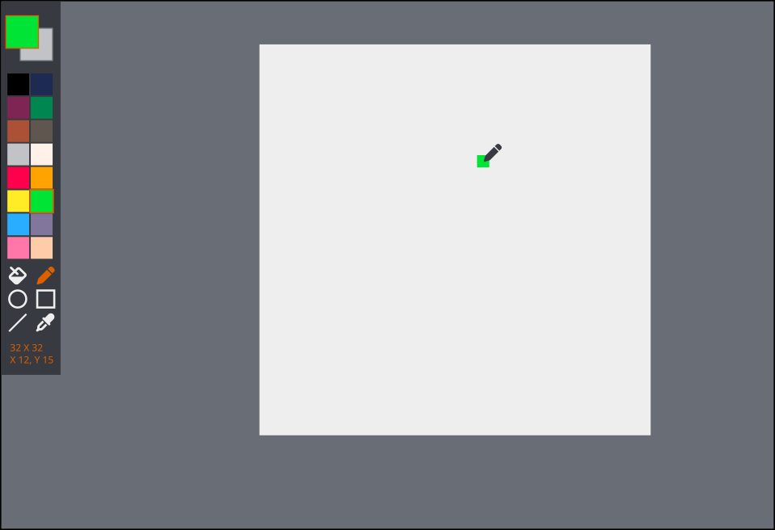

# upixel-editor

Editor Minimalista de pixel art com suporte nativo SDL e web com wasm

O projeto ainda se encontra na sua fase inicial de construção, mas um exemplo de sua aparência final foi desenhado no inkscape e se encontra na pasta [Mockups](./Mockups/)
